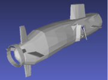
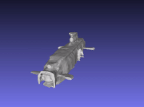
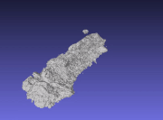
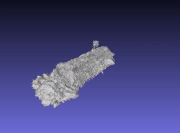
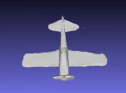
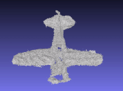
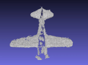

# Neural Implicit Surface Reconstruction using Imaging Sonar

This repo contains the source code for the ICRA 2023 paper [Neural Implicit Surface Reconstruction using Imaging Sonar](https://arxiv.org/abs/2209.08221)

Ground Truth Mesh             |  Our Reconstruction    |      Volumetric Albedo    |       Back-projection
:-------------------------:|:-------------------------:|:-------------------------:|:-------------------------:
  |   |   | 
  |   |   | 


# Usage

## Anaconda Environment
  Create a virtual python environment using [Anaconda](https://www.anaconda.com/products/individual):
  ```
  conda create -n neusis python=3.7
  conda activate neusis
  ```

## Setup

Install [PyTorch](https://pytorch.org/get-started/locally/) then:
``` shell
 git clone https://github.com/rpl-cmu/neusis.git
 cd neusis
 pip install -r requirements.txt
```

## Data 
Sample datasets are available for download here [datasets](https://drive.google.com/drive/folders/161PNPuIfsIwAsRjOc2PXQUkjO4F0P5Nr?usp=sharing). Unzip the files inside the ```data``` directory.   
The data is organized as follows:

```
data/<dataset_name>
|-- Data
    |-- <pose 1>.pkl        # data for each view (includes the sonar image and pose)
    |-- <pose 2>.pkl 
    ...
|-- Config.json      # Sonar configuration
```

## Running
Training:

``` python run_sdf.py --conf confs/<dataset_name>.conf ```

Example:
``` python run_sdf.py --conf confs/14deg_submarine.conf ```

The resulting meshes are saved in the following directory ```experiments/<dataset_name>/meshes```. The parameter ```val_mesh_freq``` in  ```confs/<dataset_name>.conf``` controls the frequency of mesh generation.


# Notes on training
1) We used an NVIDIA 3090 GPU for training. Depending on available compute, consider adjusting the following parameters in ```confs/<dataset_name>.conf```:

Parameter  | Description
------------- | -------------
arc_n_samples  | number of samples along each arc
num_select_pixels  | number of sampled pixels (px)
percent_select_true | percentage of px with intensity > ```ε``` that are be selected every training iteration
n_samples | number of samples along each acoustic ray


2) Depending on weight initialization, we noticed that the network might converge to "bad" local minimas. A quick way to make sure that the network is training correctly is to check that the ```intensity Loss``` is decreasing after a handful of epochs. Otherwise, please restart the training.

This issue could be mitigated via data normalization and enabling geometric initialization of network weights: [Issue](https://github.com/rpl-cmu/neusis/issues/1)


# Citation 
Consider citing as below if you find our work helpful to your project:

```
@article{qadri2022neural,
  title={Neural Implicit Surface Reconstruction using Imaging Sonar},
  author={Qadri, Mohamad and Kaess, Michael and Gkioulekas, Ioannis},
  journal={arXiv preprint arXiv:2209.08221},
  year={2022}
}
```

# Acknowledgement
Some code snippets are borrowed from [IDR](https://github.com/lioryariv/idr), and [NeuS](https://github.com/Totoro97/NeuS). Thanks for these projects!

